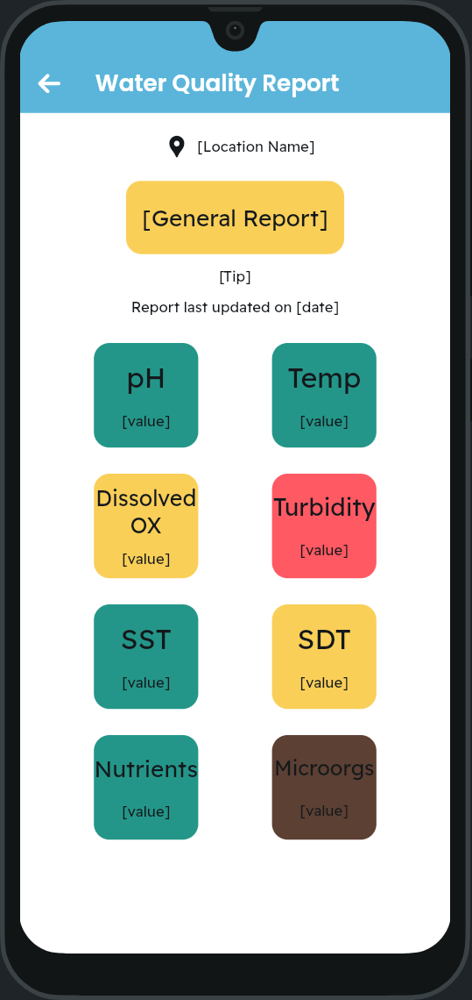
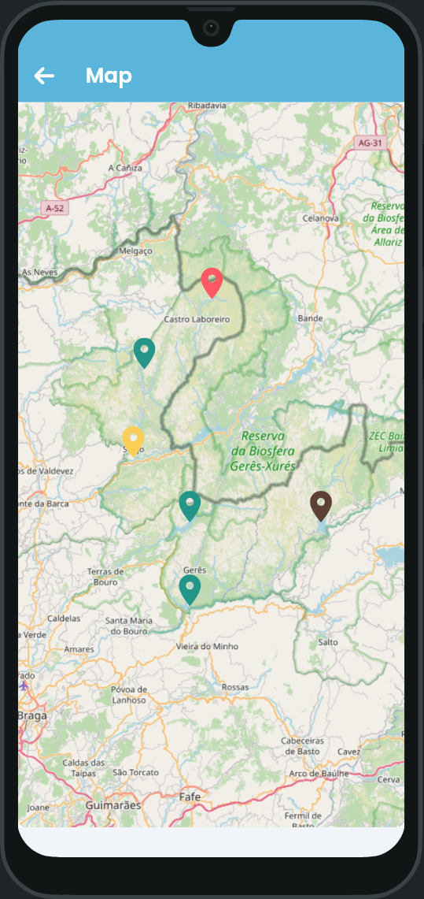
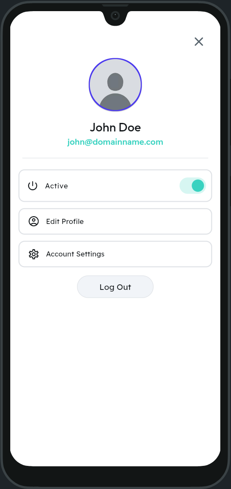
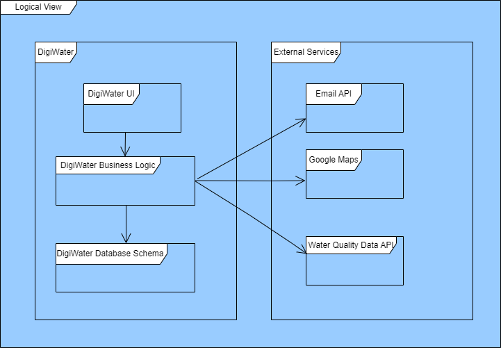

# DigiWater Development Report

Welcome to the documentation pages of the DigiWater App!

You can find here details about the DigiWater App, from a high-level vision to low-level implementation decisions, a kind of Software Development Report, organized by type of activities:

* [Business modeling](#Business-Modelling) 
  * [Product Vision](#Product-Vision)
  * [Features and Assumptions](#Features-and-Assumptions)
  * [Elevator Pitch](#Elevator-pitch)
* [Requirements](#Requirements)
  * [User stories](#User-stories)
  * [Domain model](#Domain-model)
* [Architecture and Design](#Architecture-And-Design)
  * [Logical architecture](#Logical-Architecture)
  * [Physical architecture](#Physical-Architecture)
  * [Vertical prototype](#Vertical-Prototype)
* [Project management](#Project-Management)

Contributions are expected to be made exclusively by the initial team, but we may open them to the community, after the course, in all areas and topics: requirements, technologies, development, experimentation, testing, etc.

Please contact us!

Thank you!

Ruben Francisco - up201507143@up.pt 
Rodrigo Miranda - up202204916@up.pt 
Tomás Oliveira - up202208415@up.pt
Álvaro Torres - up202208954@up.pt

---
## Business Modelling

### Product Vision

Our mobile application is designed to address the concerns of travelers, hikers and adventurers regarding the quality of water in Gerês' lakes, rivers, lagoons and small creeks. Through intuitive visualizations and metrics, DigiWater will empower travelers with crucial information about the safety of water in Gerês, helping them make informed decisions about hydration and fun.

While existing water testing devices are not mobile phone-compatible, DigiWater leverages publicly available data to offer comprehensive assessments without the need for specialized hardware. In the future we aim to extend our vision globally, recognizing the diverse water quality challenges faced by travelers across continents, from Europe to Africa and beyond.

DigiWater aims to become the go-to companion for travelers seeking reassurance and guidance on water quality, empowering them to explore with confidence and stay healthy throughout their journeys.

### Features and Assumptions

- Login via email;
- Profile with associated name, email;
- Water Quality Scan Button - click the button to do a location-based water quality scan:
    - List of nearest bodies of water appears and if location is clicked the specific report appears (Report Screen)
- Map - map-based water reports:
    - Map of Gerês with various pins with colors (quality-wise, so that bad ones can be avoided) for the different available bodies of water - if clicked sepcific Report Screen appears;
- Report Screen - specific report of a certain body of water with a general overview (report), plot of the various parameters (with color and value), as well as tips (telling if water is safe to bath, drink or use or neither). The date of the last update of the report data is also provided;
- Bookmark favourite spots - the user is also able to bookmark its favourite spots so that he can revist the respective reports later;

### Elevator Pitch

DigiWater aims to become the go-to companion for Gerês' travelers seeking reassurance and guidance on water quality, empowering them to explore with confidence and stay healthy throughout their journeys. With DigiWater, its users can do a water quality scan using its current location or use a map to search for a specific site, attaining a detailed water quality report of the specific location. Hence, one can make informed decision about future adventures in Gerês and be sure about the safety of the different water bodies Gerês has to offer.

## Requirements

In this section, you should describe all kinds of requirements for your module: functional and non-functional requirements.

### User Stories

- Epics:

As a Gerês enthusiast, I want to be able to know the quality of a body of water that’s near me (location-based).

As a Gerês enthusiast, I want to be able to search for bodies of water in advance so that I can get a report about its water quality (map-based with pins).

- User Stories:

As a hiker in Gêres, I want to find a safe body of water so that I can bathe and relax after a long walk. 

As a camper in Gêres, I want to find a good spot next to a safe body of water so that I can use it to bath and drink.

As a swimmer enthusiast, I want to easily access a detailed map of all body of water in Gêres, so I know which ones to avoid.

As a user, I want to receive up to date information about the quality of all bodies of water in Gêres, so that I don’t face misleading data that ultimately can compromise my health. (always up to date data)

As a user, I want to know when the state of a body of water was last updated, so I don’t have any doubts about its condition.

As a user, I want to search for a specific beach, lake, river, lagoon or creeks and find trustworthy information about it. (mapa com pins)

As a user, I want to bookmark my favourite spots so that I can easily access it in a next time. 

UI Mockups:

Home Screen:

Report Screen:

Map Screen:

Profile:

### Domain model

**User**:
  - Description: Represents a user of the DigiWater application.
  - Attributes:
    - email: The email address of the user used for login.
    - password: The password associated with the user's account.
    - name: The name of the user.
    - bookmarks: A list of locations bookmarked by the user.
  - Methods:
    - login(email, password): Authenticates the user with the provided email and password.
    - logout(): Logs out the user from the application.
    - updateProfile(name, email): Updates the user's profile information.

**Location**:
  - Description: Represents a geographical location, such as a lake, river, lagoon, or creek.
  - Attributes:
    - name: The name or identifier of the location.
    - latitude: The latitude coordinate of the location.
    - longitude: The longitude coordinate of the location.
  - Methods:
    - getName(): Retrieves the name of the location.
    - getLatitude(): Retrieves the latitude coordinate of the location.
    - getLongitude(): Retrieves the longitude coordinate of the location.

**WaterReport**:
  - Description: Represents a report detailing the quality of water at a specific location.
  - Attributes:
    - location: The location for which the report is generated.
    - date: The date when the report was generated.
    - parameters: A list of parameters describing the water quality.
  - Methods:
    - getLocation(): Retrieves the location associated with the report.
    - getDate(): Retrieves the date of the report.
    - getParameters(): Retrieves the parameters describing the water quality.

**Parameter**:
  - Description: Represents a specific parameter used to assess water quality.
  - Attributes:
    - name: The name or identifier of the parameter.
    - value: The value of the parameter, indicating its measurement.
    - color: The color associated with the parameter value for visualization purposes.
  - Methods:
    - getName(): Retrieves the name of the parameter.
    - getValue(): Retrieves the value of the parameter.
    - getColor(): Retrieves the color associated with the parameter value.

**DigiWaterApp**:
  - Description: Represents the main application controller managing user interactions and data retrieval.
  - Attributes:
    - user: The current user of the application.
  - Methods:
    - login(email, password): Authenticates the user with the provided email and password.
    - logout(): Logs out the user from the application.
    - updateProfile(name, email): Updates the user's profile information.
    - scanWaterQuality(): Initiates a scan of water quality at nearby locations.
    - getWaterReports(): Retrieves a list of water reports.
    - getWaterReport(location): Retrieves the water report for a specific location.
    - bookmarkLocation(location): Adds a location to the user's bookmarks.

**MapComponent**:
  - Description: Represents a UI component responsible for displaying water reports on a map.
  - Attributes:
    - waterReports: A list of water reports to be displayed on the map.
  - Methods:
    - displayWaterReports(): Displays water reports on the map.
    - displayWaterReport(location): Displays a specific water report on the map.

**ReportScreenComponent**:
  - Description: Represents a UI component responsible for displaying detailed water reports.
  - Attributes:
    - waterReport: The water report to be displayed.
  - Methods:
    - displayWaterReport(): Displays the detailed water report on the screen.

## Architecture and Design
The architecture of a software system encompasses the set of key decisions about its overall organization. 

A well written architecture document is brief but reduces the amount of time it takes new programmers to a project to understand the code to feel able to make modifications and enhancements.

To document the architecture requires describing the decomposition of the system in their parts (high-level components) and the key behaviors and collaborations between them. 

In this section you should start by briefly describing the overall components of the project and their interrelations. You should also describe how you solved typical problems you may have encountered, pointing to well-known architectural and design patterns, if applicable.

### Logical architecture 
The purpose of this subsection is to document the high-level logical structure of the code (Logical View), using a UML diagram with logical packages, without the worry of allocating to components, processes or machines.

 

**DigiWater UI Package**: This package represents the components responsible for the presentation layer of the system. 

**DigiWater Business Logic**: This package represents the components responsible for implementing the core functionality and rules of the system. 

**DigiWater Database Schema**: This package represents the structure and organization of the database underlying the system.  

As of External Services, the **Email API** is a vital component in this system. It enables communication via email and facilitates automated email-based workflows and notifications. The **Google Maps API** provides a comprehensive set of tools and services for incorporating mapping, geolocation, and location-based services. The **Water Quality Data API** provides access to various data related to water quality measurements, such as pH levels, dissolved oxygen, turbidity, temperature, and pollutant concentrations in bodies of water, in this case specifically in Gêres. 

### Physical architecture
The goal of this subsection is to document the high-level physical structure of the software system (machines, connections, software components installed, and their dependencies) using UML deployment diagrams (Deployment View) or component diagrams (Implementation View), separate or integrated, showing the physical structure of the system.

It should describe also the technologies considered and justify the selections made. Examples of technologies relevant for ESOF are, for example, frameworks for mobile applications (such as Flutter).

Example of _UML deployment diagram_ showing a _deployment view_ of the Eletronic Ticketing System (please notice that, instead of software components, one should represent their physical/executable manifestations for deployment, called artifacts in UML; the diagram should be accompanied by a short description of each node and artifact):

### Vertical prototype
To help on validating all the architectural, design and technological decisions made, we usually implement a vertical prototype, a thin vertical slice of the system integrating as much technologies we can.

In this subsection please describe which feature, or part of it, you have implemented, and how, together with a snapshot of the user interface, if applicable.

At this phase, instead of a complete user story, you can simply implement a small part of a feature that demonstrates thay you can use the technology, for example, show a screen with the app credits (name and authors).

## Project management
Software project management is the art and science of planning and leading software projects, in which software projects are planned, implemented, monitored and controlled.

In the context of ESOF, we recommend each team to adopt a set of project management practices and tools capable of registering tasks, assigning tasks to team members, adding estimations to tasks, monitor tasks progress, and therefore being able to track their projects.

Common practices of managing iterative software development are: backlog management, release management, estimation, iteration planning, iteration development, acceptance tests, and retrospectives.

You can find below information and references related with the project management in our team: 

* Backlog management: Product backlog and Sprint backlog in a [Github Projects board](https://github.com/orgs/FEUP-LEIC-ES-2023-24/projects/64);
* Release management: [v0](#), v1, v2, v3, ...;
* Sprint planning and retrospectives: 
  * plans: screenshots of Github Projects board at begin and end of each iteration;
  * retrospectives: meeting notes in a document in the repository;
