# DigiWater Development Report

Welcome to the documentation pages of the DigiWater App!

You can find here details about the DigiWater App, from a high-level vision to low-level implementation decisions, a kind of Software Development Report, organized by type of activities:

* [Business modeling](#Business-Modelling) 
  * [Product Vision](#Product-Vision)
  * [Features and Assumptions](#Features-and-Assumptions)
  * [Elevator Pitch](#Elevator-pitch)
* [Requirements](#Requirements)
  * [User stories](#User-stories)
  * [Domain model](#Domain-model)
* [Architecture and Design](#Architecture-And-Design)
  * [Logical architecture](#Logical-Architecture)
  * [Physical architecture](#Physical-Architecture)
  * [Vertical prototype](#Vertical-Prototype)
* [Project management](#Project-Management)

Contributions are expected to be made exclusively by the initial team, but we may open them to the community, after the course, in all areas and topics: requirements, technologies, development, experimentation, testing, etc.

Please contact us!

Thank you!

Ruben Francisco - up201507143@up.pt 
Rodrigo Miranda - up202204916@up.pt 
Tomás Oliveira - up202208415@up.pt
Álvaro Torres - up202208954@up.pt

---
## Business Modelling

### Product Vision

DigiWater aims to become the go-to companion for Gerês' travelers seeking reassurance and guidance on water quality, empowering them to explore with confidence and stay healthy throughout their journeys.
In the future we aim to extend our vision globally, recognizing the diverse water quality challenges faced by travelers across continents, from Europe to Africa and beyond. Because water is life!

### Features and Assumptions

- Map - map-based water reports:
    - Map of Gerês with various pins with colors (quality-wise, so that bad ones can be avoided) for the different available bodies of water - if clicked sepcific Report Screen appears;
- Report Screen - specific report of a certain body of water with a general overview (report), plot of the various parameters (with color and value), as well as tips (telling if water is safe to bath, drink or use or neither). The date of the last update of the report data is also provided;
- Bookmark favourite spots - the user is also able to bookmark its favourite spots so that he can revist the respective reports later;

- We assume the app will depend on an API to a map-service (maybe OpenStreetMap). The underlying data for our app will have to be partially simulated by us, as we assume there is not very much data available (yet).

### Elevator Pitch

Todos nós já tivemos dúvidas se poderíamos beber água de uma certa fonte ou se deveríamos mergulhar num lago desconhecido. Uma decisão errada pode ter graves consequências.
Bem, com a DigiWater esse problema deixará de existir. 
A DigiWater tem como missão facilitar o acesso a dados sobre a qualidade da água, funcionando como um megafone. 
Através de um mapa com pins e da visualização de dados intuitiva em forma de relatórios de qualidade da água, a DigiWater irá ajudar os seus utilizadores a tomarem decisões mais informadas no que toca ao consumo e utilização de água.
Globalmente, todos, desde autoridades e empresas credenciadas de teste de águas até indivíduos com dispositivos confiáveis ​​de alta tecnologia para testes de água, poderão contribuir para a rede da DigiWater e, assim, ajudar a cumprir a missão de fornecer dados sobre a segurança e qualidade da água a todos.
Porque água é vida, não é verdade?

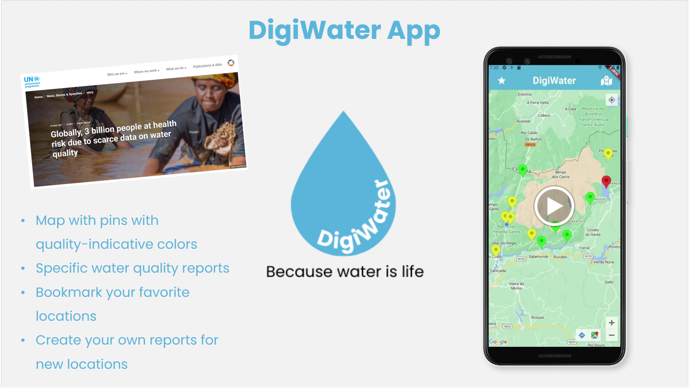

#### Good example to follow: [barragens.pt](https://barragens.pt/)

#### Competition/Collaborations: 

## Requirements

### Domain model

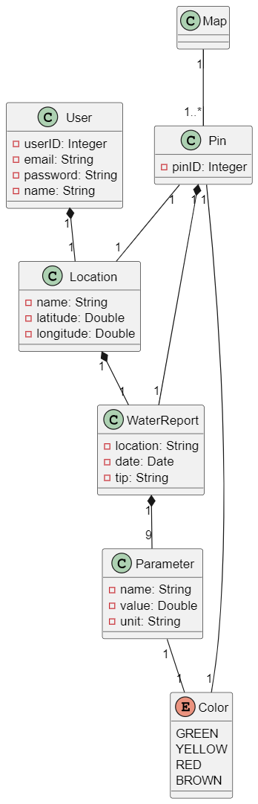

The DigiWater app aims to to address the concerns of travelers, hikers and adventurers regarding the quality of water in Gerês' lakes, rivers, lagoons and small creeks. Each User, after logging in, has an unique ID, as well as an email, password and name associated to it. Each user has also always a (current) location which has a name and a latitude and longitude. The location shall be a lake, river, lagoon or creek in Gerês. The DigiWater app also has a Map that has many unique Pins. Each pin has a color, a location and one WaterReport associated to it. A water report represents a report detailing the quality of water at a specific location. It has a unique location, a date, a tip and 9 associated Parameters used to assess water quality. Each Parameter has a name, value and unit, as well as a color associated to it.

## Architecture and Design

The architecture of a software system encompasses the set of key decisions about its overall organization. 

A well written architecture document is brief but reduces the amount of time it takes new programmers to a project to understand the code to feel able to make modifications and enhancements.

To document the architecture requires describing the decomposition of the system in their parts (high-level components) and the key behaviors and collaborations between them. 

In this section you should start by briefly describing the overall components of the project and their interrelations. You should also describe how you solved typical problems you may have encountered, pointing to well-known architectural and design patterns, if applicable.

### Logical architecture 

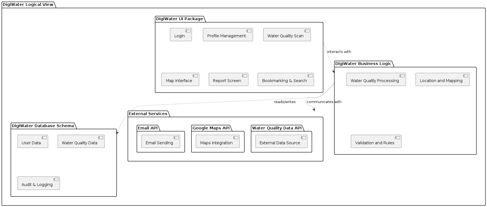 

**DigiWater UI Package**: This package represents the components responsible for the presentation layer of the system. 

**DigiWater Business Logic**: This package represents the components responsible for implementing the core functionality and rules of the system. 

**DigiWater Database Schema**: This package represents the structure and organization of the database underlying the system.  

As of External Services, the **Email API** is a vital component in this system. It enables communication via email and facilitates automated email-based workflows and notifications. The **Google Maps API** provides a comprehensive set of tools and services for incorporating mapping, geolocation, and location-based services. The **Water Quality Data API** provides access to various data related to water quality measurements, such as pH levels, dissolved oxygen, turbidity, temperature, and pollutant concentrations in bodies of water, in this case specifically in Gêres. 

### Physical architecture

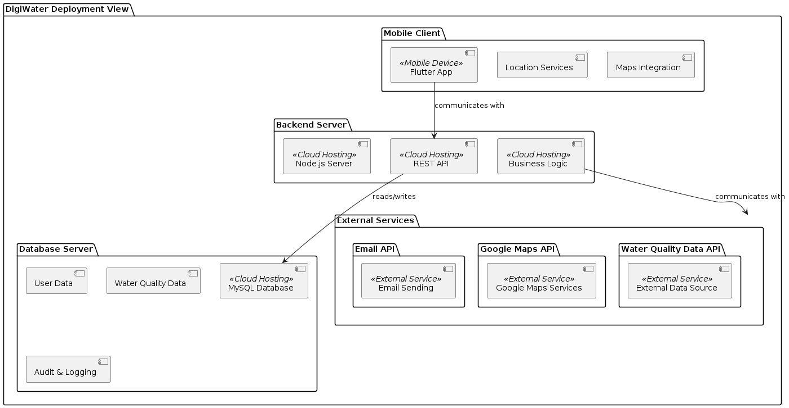

The physical architecture of the DigiWater system consists of the following components: 

**Mobile Client:**
- A Flutter-based app on users' smartphones and tablets.
- Communicates with the backend server via HTTP/HTTPS. 

**Backend Server:**
- A Node.js server hosting the business logic and REST API.
- Typically hosted on a cloud platform.
- Connects to the database and external services. 

**Database Server:**
- A MySQL database for user data, water quality reports, and audit/logging.
- Hosted in the cloud or on a dedicated server. 

**External Services:**
Third-party services used for additional functionality, such as:
- Email API for notifications.
- Google Maps API for geolocation.
- Water Quality Data API for additional data. 

### Interactions:
- The Mobile Client communicates with the Backend Server for requests and data retrieval.
- The Backend Server interacts with the Database Server for data storage and with External Services for additional features.

### Vertical prototype

As a product increment #0 (vertical prototype) we decided to implement the Home Screen, that is the main screen of our app where the user can do a location-based water quality scan by click the button in the center of the screen. 
We already implemented the Flutter (Dart) code for other features of our app, but chose the main screen as the product increment #0 (vertical prototype).

Snapshot of the user interface:

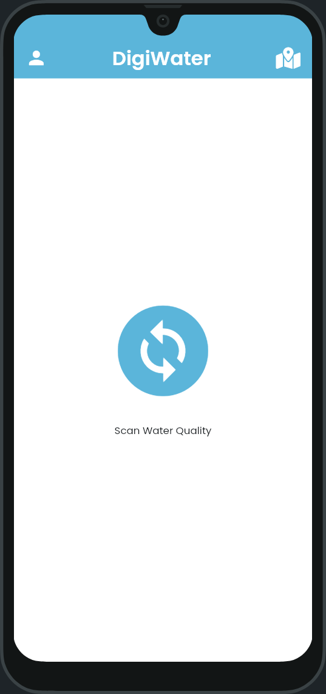

## Project management

### Sprint 1

- Scrum board at the end of the Sprint 1 Planning:

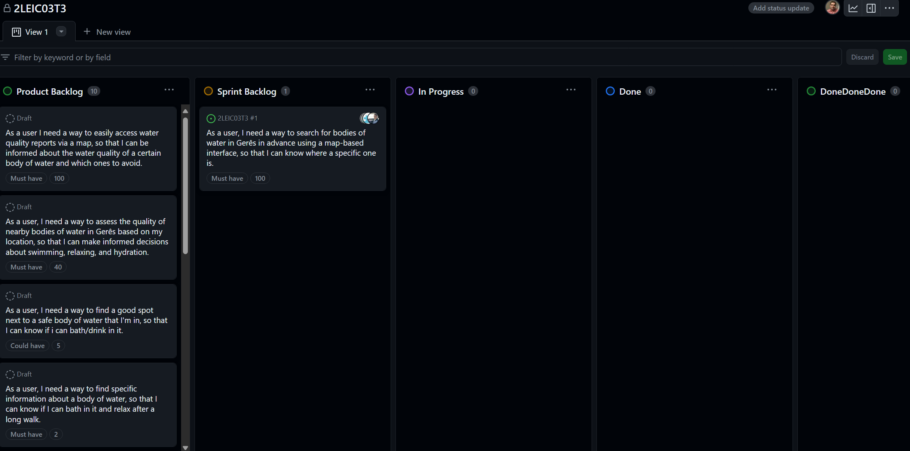

- Scrum board after Sprint 1:

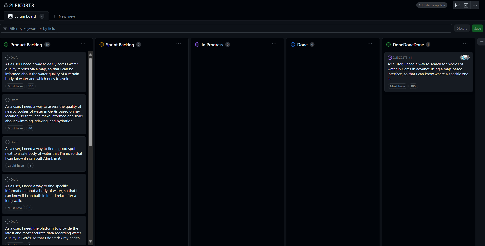

- Notes on the Sprint Review:

Demo of the product increment was successfully done on the web, because we had problems launching our app in an emulator and release of the product increment was created in Github.
Goals of the Sprint 1 were accomplished and delivered features add value to the end-user. Product backlog was adapted accordingly.

- Notes on the Sprint Retrospective:

We implemented what we had planned and are satisfied with what we did and how we worked as a team.
Unfortunately, we weren't able to test and launch our app using an emulator, just in the web. This problem still puzzles us and solving it is our top-priority now. We plan to solve the problem in the ESOF Tech Wizards (Clinic), with the help of more experienced students.

- Happiness Meter after Sprint 1:

We are very happy and proud about this Sprint 1.

### Sprint 2

- Scrum board at the end of the Sprint 2 Planning:

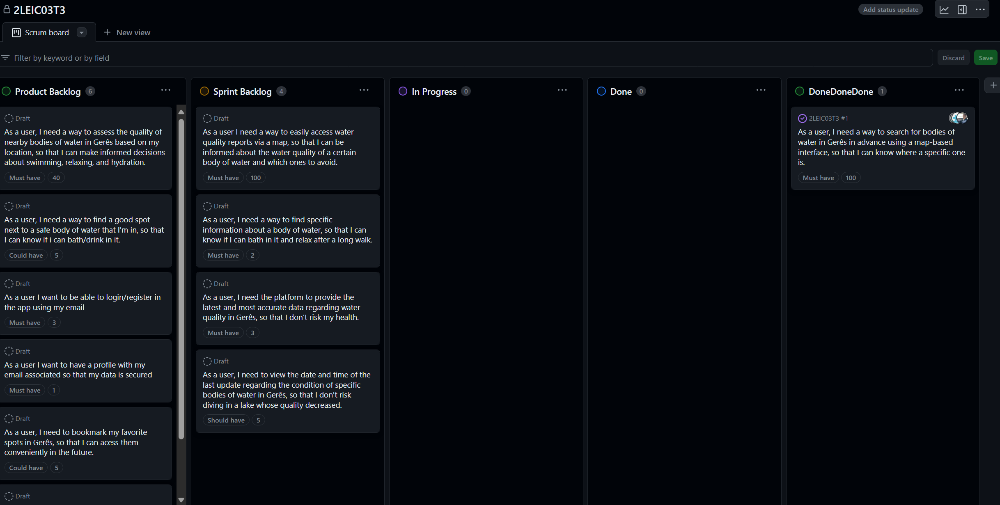

- Scrum board after Sprint 2:

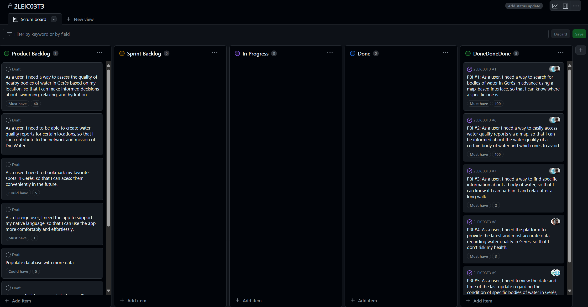

- Notes on the Sprint Review:

Demo of the product increment was successfully done on android phone emulator and release of the product increment was created in Github.
Goals of the Sprint 2 were accomplished and delivered features add value to the end-user. Product backlog was adapted accordingly, with some user stories being deleted and others updated and added after talking with Product Owner.

- Notes on the Sprint Retrospective:

We implemented what we had planned and are satisfied with what we did and how we worked as a team. What can be improved is the creation of acceptance, unit and integration tests to verify the product increment's correct operation. We plan to allocate more time to this task to solve the problem.

### Sprint 3

- Scrum board at the end of the Sprint 3 Planning:

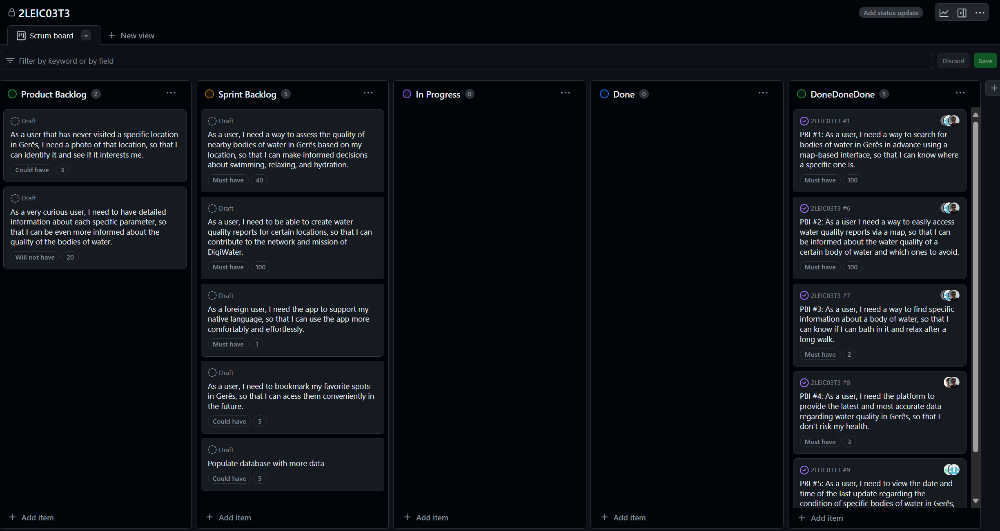

- Scrum board after Sprint 3:

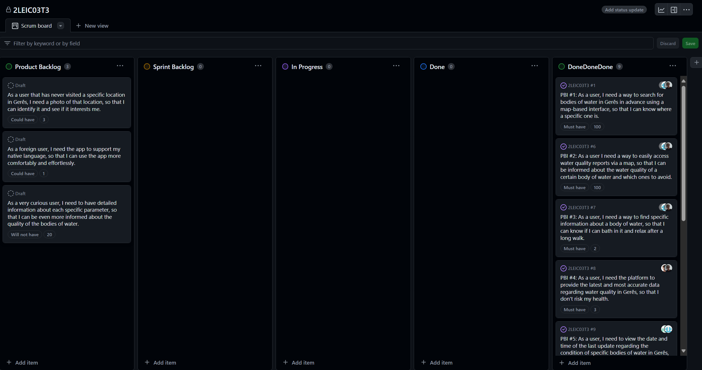

- Notes on the Sprint Review:

Demo of the product increment was successfully done on android phone emulator and release of the product increment was created in Github with the corresponding APK.

- Notes on the Sprint Retrospective:

We implemented what we had planned and are satisfied with what we did and how we worked as a team. We did not have any problems or issues that require a strategy to solve them. Regarding Sprint 2, we recongized that we didn't allocate enough time to the implementation and creation of tests. After Sprint 2 retrospective and corresponding strategy we did indeed allocate more time to testing and hence completed Sprint 3 with more tests for our app.
