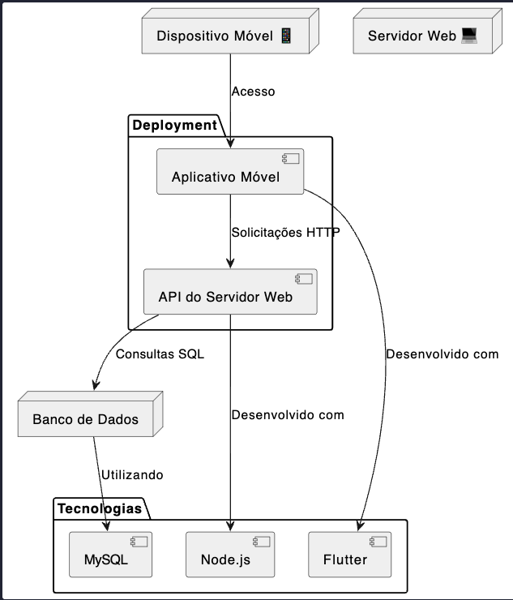

# DigiWater Development Report

Welcome to the documentation pages of the DigiWater App!

You can find here details about the DigiWater App, from a high-level vision to low-level implementation decisions, a kind of Software Development Report, organized by type of activities:

* [Business modeling](#Business-Modelling) 
  * [Product Vision](#Product-Vision)
  * [Features and Assumptions](#Features-and-Assumptions)
  * [Elevator Pitch](#Elevator-pitch)
* [Requirements](#Requirements)
  * [User stories](#User-stories)
  * [Domain model](#Domain-model)
* [Architecture and Design](#Architecture-And-Design)
  * [Logical architecture](#Logical-Architecture)
  * [Physical architecture](#Physical-Architecture)
  * [Vertical prototype](#Vertical-Prototype)
* [Project management](#Project-Management)

Contributions are expected to be made exclusively by the initial team, but we may open them to the community, after the course, in all areas and topics: requirements, technologies, development, experimentation, testing, etc.

Please contact us!

Thank you!

Ruben Francisco - up201507143@up.pt 
Rodrigo Miranda - up202204916@up.pt 
Tomás Oliveira - up202208415@up.pt
Álvaro Torres - up202208954@up.pt

---
## Business Modelling

### Product Vision

DigiWater aims to become the go-to companion for Gerês' travelers seeking reassurance and guidance on water quality, empowering them to explore with confidence and stay healthy throughout their journeys. With DigiWater, its users can do a water quality scan using its current location or use a map to search for a specific site, attaining a detailed water quality report of the specific location. Hence, one can make informed decision about future adventures in Gerês and be sure about the safety of the different water bodies Gerês has to offer.

### Features and Assumptions

- Login via email;
- Profile with associated name, email;
- Water Quality Scan Button - click the button to do a location-based water quality scan:
    - List of nearest bodies of water appears and if location is clicked the specific report appears (Report Screen)
- Map - map-based water reports:
    - Map of Gerês with various pins with colors (quality-wise, so that bad ones can be avoided) for the different available bodies of water - if clicked sepcific Report Screen appears;
- Report Screen - specific report of a certain body of water with a general overview (report), plot of the various parameters (with color and value), as well as tips (telling if water is safe to bath, drink or use or neither). The date of the last update of the report data is also provided;
- Bookmark favourite spots - the user is also able to bookmark its favourite spots so that he can revist the respective reports later;

- We assume the app will depend on an API to a map-service (maybe OpenStreetMap). The underlying data for our app will have to be partially simulated by us, as we assume there is not very much data available (yet).

### Elevator Pitch

Our mobile application, DigiWater, is designed to address the concerns of travelers, hikers and adventurers regarding the quality of water in Gerês' lakes, rivers, lagoons and small creeks. Through intuitive visualizations and metrics, DigiWater will empower travelers with crucial information about the safety of water in Gerês, helping them make informed decisions about hydration and fun.
While existing water testing devices are not mobile phone-compatible, DigiWater leverages publicly available data to offer comprehensive assessments without the need for specialized hardware. In the future we aim to extend our vision globally, recognizing the diverse water quality challenges faced by travelers across continents, from Europe to Africa and beyond.

## Requirements

In this section, you should describe all kinds of requirements for your module: functional and non-functional requirements.

### User Stories

- Epics:

As a Gerês enthusiast, I want to be able to know the quality of a body of water that’s near me (location-based).

As a Gerês enthusiast, I want to be able to search for bodies of water in advance so that I can get a report about its water quality (map-based with pins).

- User Stories:

As a hiker in Gêres, I want to find a safe body of water so that I can bathe and relax after a long walk. 

  Given that I am a hiker in Gêres
  When I search for nearby bodies of water
  Then I should be provided with information on safe options for bathing, relaxing, and hydrating after my hike

As a camper in Gêres, I want to find a good spot next to a safe body of water so that I can use it to bath and drink.

  Given that I am a camper in Gêres
  When I search for camping spots near bodies of water
  Then I should be presented with options that include safe bathing areas 

As a swimmer enthusiast, I want to easily access a detailed map of all body of water in Gêres, so I know which ones to avoid.

  Given that I am a swimmer enthusiast
  When I access the map of bodies of water in Gêres
  Then I should be able to view detailed information indicating which areas to avoid

As a user, I want to receive up to date information about the quality of all bodies of water in Gêres, so that I don’t face misleading data that ultimately can compromise my health. (always up to date data)

  Given that I am a user seeking information about the quality of bodies of water in Gêres
  When I access the platform
  Then I should receive the latest and most accurate data regarding water quality

As a user, I want to know when the state of a body of water was last updated, so I don’t have any doubts about its condition.

  Given that I am viewing information about a specific body of water in Gêres
  When I check its status
  Then I should see the date and time of the last update regarding its condition

As a user, I want to search for a specific beach, lake, river, lagoon or creeks and find trustworthy information about it. (mapa com pins)

  Given that I want to find information about a specific body of water in Gêres
  When I search for it by name or type
  Then I should be presented with reliable and detailed information about that location

As a user, I want to bookmark my favourite spots so that I can easily access it in a next time. 

  Given that I have found a favorite spot at a body of water in Gêres
  When I navigate to its profile
  Then I should be able to bookmark it for easy access in the future

- UI Mockups:

Home Screen:

Report Screen:

Map Screen:

Profile:

### Domain model

The DigiWater app aims to to address the concerns of travelers, hikers and adventurers regarding the quality of water in Gerês' lakes, rivers, lagoons and small creeks. Each User, after logging in, has an unique ID, as well as an email, password and name associated to it. Each user has also always a (current) location which has a name and a latitude and longitude. The location shall be a lake, river, lagoon or creek in Gerês. The DigiWater app also has a Map that has many unique Pins. Each pin has a color, a location and one WaterReport associated to it. A water report represents a report detailing the quality of water at a specific location. It has a unique location, a date, a tip and 9 associated Parameters used to assess water quality. Each Parameter has a name, value and unit, as well as a color associated to it.

## Architecture and Design
The architecture of a software system encompasses the set of key decisions about its overall organization. 

A well written architecture document is brief but reduces the amount of time it takes new programmers to a project to understand the code to feel able to make modifications and enhancements.

To document the architecture requires describing the decomposition of the system in their parts (high-level components) and the key behaviors and collaborations between them. 

In this section you should start by briefly describing the overall components of the project and their interrelations. You should also describe how you solved typical problems you may have encountered, pointing to well-known architectural and design patterns, if applicable.

### Logical architecture 

 

**DigiWater UI Package**: This package represents the components responsible for the presentation layer of the system. 

**DigiWater Business Logic**: This package represents the components responsible for implementing the core functionality and rules of the system. 

**DigiWater Database Schema**: This package represents the structure and organization of the database underlying the system.  

As of External Services, the **Email API** is a vital component in this system. It enables communication via email and facilitates automated email-based workflows and notifications. The **Google Maps API** provides a comprehensive set of tools and services for incorporating mapping, geolocation, and location-based services. The **Water Quality Data API** provides access to various data related to water quality measurements, such as pH levels, dissolved oxygen, turbidity, temperature, and pollutant concentrations in bodies of water, in this case specifically in Gêres. 

### Physical architecture

The physical architecture of the DigiWater system consists of the following components:

### Nodes:
- **Mobile Device:** Represents a smartphone or tablet where the DigiWater mobile application is installed and run.
- **Server (Computer):** Represents a web server where the DigiWater server API is hosted.

### Artifacts:
- **DigiWater App:** The mobile application installed on users' devices, developed using the Flutter framework.
- **Server API:** The server-side API responsible for handling requests from the mobile application and interacting with the database.
- **Database (MySQL):** The MySQL database used to store data about water quality, including analysis reports and location history.

### Technologies:
- **Flutter:** The framework used to develop the DigiWater mobile application.
- **Node.js:** The runtime environment used to host the DigiWater server API.
- **MySQL:** The relational database management system used to store data for the DigiWater application.

### Vertical prototype

As a product increment #0 (vertical prototype) we decided to implement the Home Screen, that is the main scrren of our app where the user can do a location-based water quality scan by click the button in the center of the screen. 
We already implemented the Flutter (Dart) code for other features of our app, but chose the main screen as the product increment #0 (vertical prototype).

Snapshot of the user interface:

## Project management
Software project management is the art and science of planning and leading software projects, in which software projects are planned, implemented, monitored and controlled.

In the context of ESOF, we recommend each team to adopt a set of project management practices and tools capable of registering tasks, assigning tasks to team members, adding estimations to tasks, monitor tasks progress, and therefore being able to track their projects.

Common practices of managing iterative software development are: backlog management, release management, estimation, iteration planning, iteration development, acceptance tests, and retrospectives.

You can find below information and references related with the project management in our team: 

* Backlog management: Product backlog and Sprint backlog in a [Github Projects board](https://github.com/orgs/FEUP-LEIC-ES-2023-24/projects/64);
* Release management: [v0](#), v1, v2, v3, ...;
* Sprint planning and retrospectives: 
  * plans: screenshots of Github Projects board at begin and end of each iteration;
  * retrospectives: meeting notes in a document in the repository;
